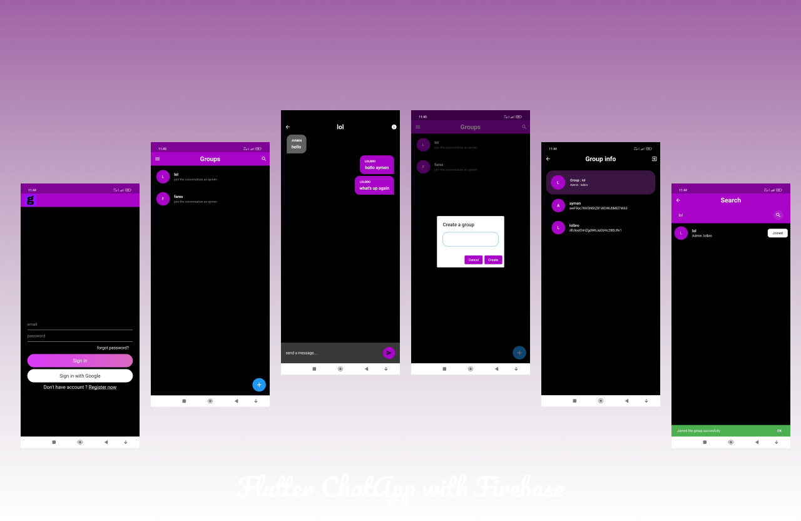

# The Holy Quran App (القرآن الكريم)

Application of the g chat, developed using Flutter & Dart.

## 🎯 Main Features
✅ Create new account (name and email and password or with Gmail)

✅ Works online

✅ search for groups by the name 

✅ Profile page

✅ Groups page

✅ Chat page with Grouo info contains the admin and group members

✅ Can create your own group

🔜 Profile photo (comming soon)

## ⚙ Installation steps

You can copy anything from the code source.

## 🧑 Author

__Guir md Abdelhai__

If you liked the repo then kindly support it by giving it a star ⭐!

